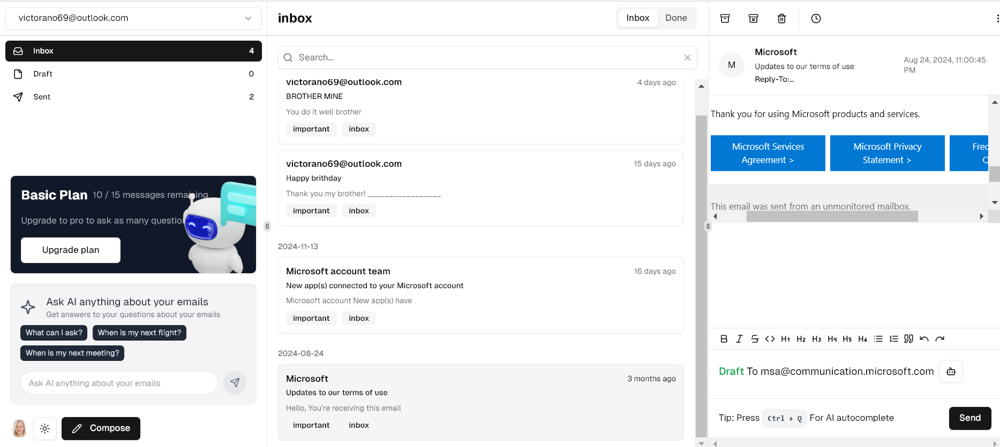
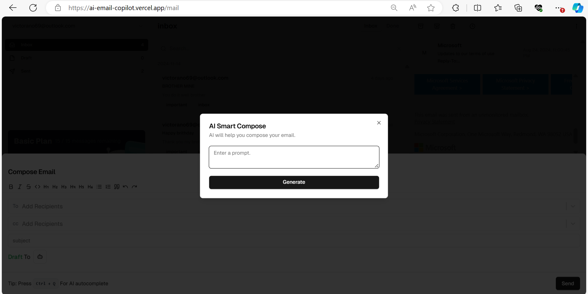
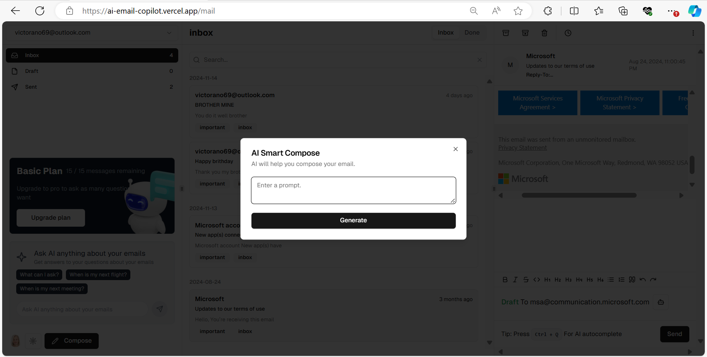
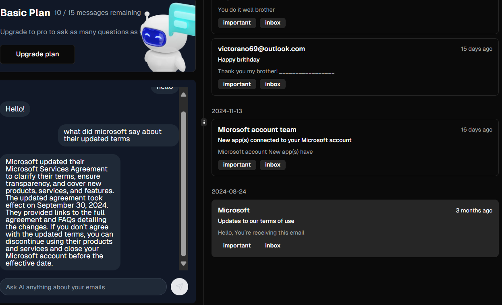
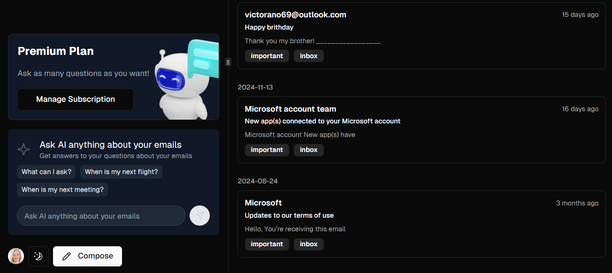

# AI Email Client

Effortlessly sync emails across multiple devices, ensuring seamless access to your inbox.  
 

## Fully enhanced with AI:

- Generate tailored email content by simply providing a brief prompt or context.
   
  
   
  

- Benefit from intelligent autocomplete suggestions triggered by the `ctrl + Q` shortcut, significantly accelerating the writing process.

- Engage in natural language conversations with AI to extract valuable insights from your email data. Query your email history and receive personalized recommendations.  
   
  

- Unlock the full potential of AI with the premium plan, adding up to 3 email accounts and offering unlimited access to AI-powered features throughout the day. (basic plan allow only 1 email account and 15 AI helps daily)
   
  

## What tech stacks and libraries are used in this project?

This is a [T3 Stack](https://create.t3.gg/) project bootstrapped with `create-t3-app`.

- [Next.js](https://nextjs.org)
- [NextAuth.js](https://next-auth.js.org)
- [Prisma](https://prisma.io)
- [Drizzle](https://orm.drizzle.team)
- [Tailwind CSS](https://tailwindcss.com)
- [tRPC](https://trpc.io)
- Shadcn-UI: For the UI components
- Neon DB: As the primary database to store data
- Orama: For Rag and vector search
- Aurinko: The Email Client API used
- Stripe: For payment and subscription plan managements
- GoogleGenerativeAI: As the LLM Model
- Vercel AI sdk: To stream AI response
- react-avatar: For user avatars
- react-select: For selecting cc and Bccs
- Clerk: For user authentication
- Sonner: For toasting error and other messages
- Next-Themes: To toggle light and dark mode
- K bar: For enabling keyboard shortcuts
- Tiptap: Enabling an headless WYSIWYG editor in the reply and compose email body
- framer-motion: For interesting animations
- Jotai: For the useAtom hook to store react.useState values as an atom
- useHooks-ts: For the useLocalStorage hook to store react.useState values in local storage
- DomPurify: For protecting dangerously set innerHtml
- etc
